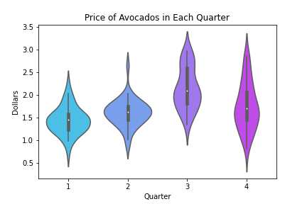
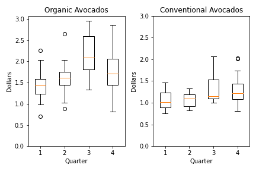
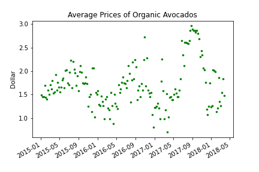
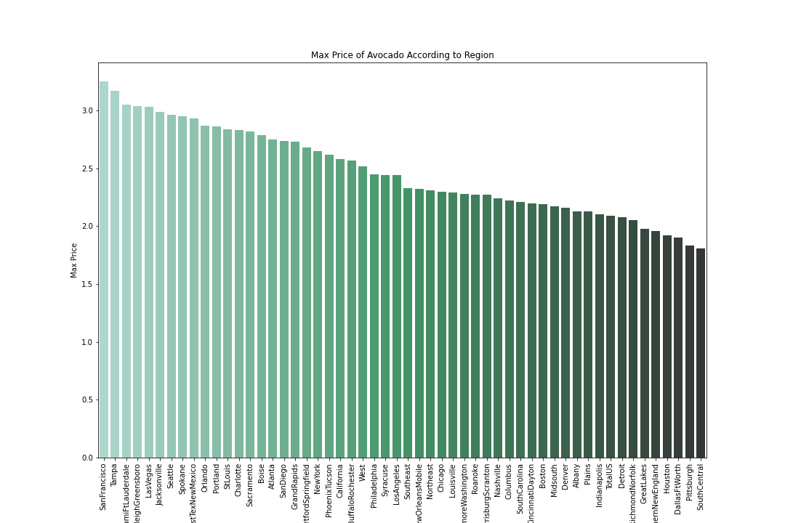
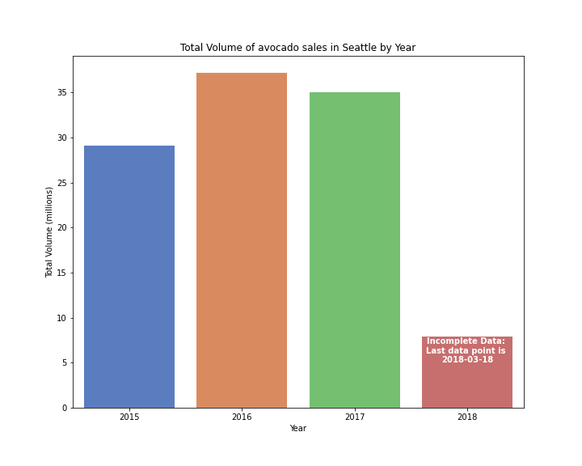

# Avocado price data visualization

> This dataset is from Kaggle.com, the original source can be found [here](https://www.kaggle.com/neuromusic/avocado-prices).

This repository is a demonstration of simple data visualization using `Python`, and some popular libraries such as `matplotlib`, `numpy`, and `seaborn`. 

These files were part of the final project for the course CS110 - *Introduction of Computer Programming* @ North Seattle College. It was the very first programming class I took.

## Graph showcase

1. Price per quarter (Violin Plot)

2. Price differences of Organic vs Conventional avocados by quarters (Box Plot)

3. Average price of avocados for all dates (Scatter Plot)

4. Max price of avocados by region (Bar graph)

5. Volume of avocado sales in Seattle (Bar graph)

-------

In the script, there's a helper function that generate random avocado prices within a given range. It also replies with a snarky comments to sprinkle a little sense of humor to this quick project.

Thanks for reading to the end! 😃